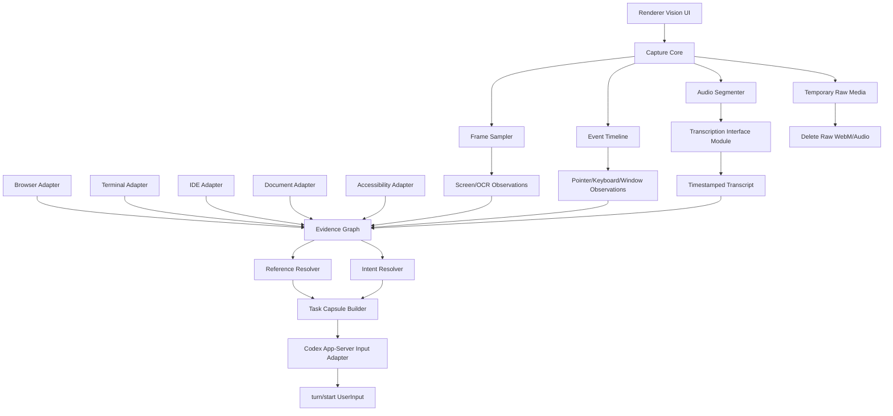
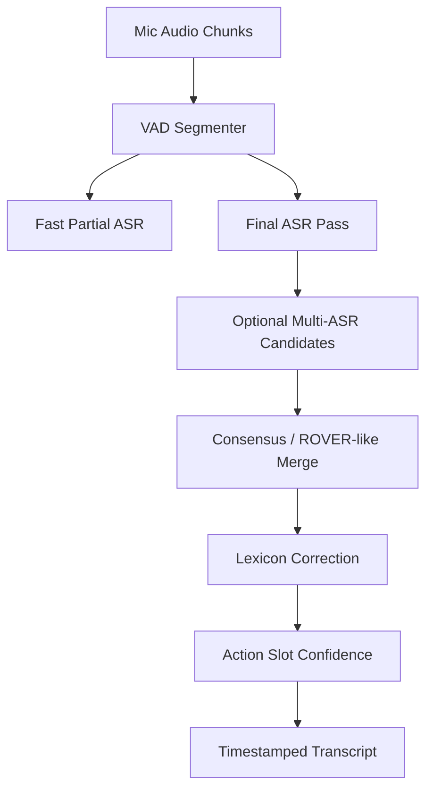

# Vision Context Interface Module Handoff

Status: planning handoff  
Target repo: `C:\Users\Tony\Workspace\codex-widget-for-desktop`  
Target integration: Tauri + React Codex Widget daemon, Codex app-server runtime  
Primary goal: build an independent module that converts desktop/browser/user capture input into Codex app-server-compatible Vision Context input.

## 1. Session Summary

This handoff captures the design discussion for a universal Vision Context feature.

Codex app-server currently does not expose a first-class video prompt input. Local inspection of `codex-cli 0.128.0` generated protocol types showed that `turn/start` and `turn/steer` accept `UserInput[]`, where the supported model-visible user input variants are:

```ts
type UserInput =
  | { type: "text"; text: string; text_elements: TextElement[] }
  | { type: "image"; url: string }
  | { type: "localImage"; path: string }
  | { type: "skill"; name: string; path: string }
  | { type: "mention"; name: string; path: string };
```

The advertised input modalities are currently:

```ts
type InputModality = "text" | "image";
```

Therefore the module must not rely on sending WebM/video directly to Codex. The correct design is to present a streaming-like user experience while internally converting screen/audio/pointer/app context into:

- text capsule
- selected full-frame screenshots
- selected cropped screenshots
- timestamped event metadata
- optional semantic adapter outputs
- optional low-confidence clarification metadata

The raw WebM/audio recording is temporary processing material only and must be deleted after derived context artifacts are generated.

## 2. Product Goal

Build a standalone feature module that lets a user press:

`Vision > Share with Agent`

Then:

1. select a window/screen/application/tab
2. speak naturally while optionally pointing, circling, dragging, scrolling, typing, or doing nothing
3. stop sharing
4. have the daemon produce a `TaskCapsule`
5. convert that `TaskCapsule` into Codex app-server `UserInput[]`
6. send the generated context into the current Codex thread via `turn/start`

The user should feel like they streamed visual context to the agent, even though the app-server receives text and image inputs.

Preferred user-facing framing:

- Good: `Share visual context with Agent`
- Avoid: `Stream video to Agent`

Reason: video is not actually a model input; the stream is a capture UX and preprocessing mechanism.

## 3. Non-Goals

This module is not frontend-specific.

Frontend/code repair is only one adapter use case. The universal feature must handle:

- web browsing
- community/forum posts
- maps and travel pages
- terminal errors
- IDE/file context
- documents/PDFs
- desktop app UI
- spreadsheets
- design tools
- general "what is this?" visual questions

The module should not require each domain to generate prompts directly. Domain adapters produce observations; a central resolver builds the final capsule.

## 4. High-Level Architecture



## 5. Module Boundaries

Implement as two independent modules plus a thin integration layer.

### 5.1 Vision Context Interface Module

Suggested ownership:

```text
src/daemon/vision-context/
  index.ts
  types.ts
  captureSession.ts
  frameSampler.ts
  eventTimeline.ts
  evidenceGraph.ts
  referenceResolver.ts
  intentResolver.ts
  capsuleBuilder.ts
  appServerInputAdapter.ts
  retention.ts
  adapters/
    screenAdapter.ts
    browserAdapter.ts
    terminalAdapter.ts
    ideAdapter.ts
    documentAdapter.ts
    accessibilityAdapter.ts
```

Responsibilities:

- accept capture/session inputs
- normalize observations from all providers
- build an Evidence Graph
- resolve user utterance references like `여기`, `저기`, `이거`, `방금 그 오류`
- build a `TaskCapsule`
- emit Codex app-server compatible `UserInput[]`
- enforce raw media deletion policy

### 5.2 Transcription Interface Module

Suggested ownership:

```text
src/daemon/transcription/
  index.ts
  types.ts
  vad.ts
  asrEngine.ts
  asrRouter.ts
  lexiconStore.ts
  sessionLexicon.ts
  consensus.ts
  correction.ts
  confidence.ts
  tutorialProfile.ts
  retention.ts
```

Responsibilities:

- segment microphone audio
- run one or more local ASR engines
- apply global/user/session lexicons
- generate timestamped transcript
- produce confidence metadata
- produce action-slot confidence rather than annoying whole-transcript confirmations
- delete raw audio chunks after derived transcript data is complete

## 6. Core Data Model

### 6.1 Capture Session

```ts
export type VisionCaptureSession = {
  id: string;
  sessionId?: string;
  startedAt: string;
  stoppedAt?: string;
  source: CaptureSource;
  userProfileId?: string;
  retention: VisionRetentionPolicy;
  timeline: CaptureEvent[];
};
```

```ts
export type CaptureSource = {
  kind: "screen" | "window" | "browser_tab" | "app";
  appName?: string;
  windowTitle?: string;
  url?: string;
  viewport?: { width: number; height: number; devicePixelRatio?: number };
};
```

### 6.2 Retention Policy

Raw recording must be deleted after processing.

```ts
export type VisionRetentionPolicy = {
  rawVideo: "delete_after_processing";
  rawAudio: "delete_after_processing";
  derivedFrames: "keep_selected" | "delete_after_turn";
  fullFrames: "keep_selected" | "crop_only";
  transcript: "keep" | "delete_after_turn";
};
```

Default:

```ts
const DEFAULT_RETENTION: VisionRetentionPolicy = {
  rawVideo: "delete_after_processing",
  rawAudio: "delete_after_processing",
  derivedFrames: "keep_selected",
  fullFrames: "keep_selected",
  transcript: "keep"
};
```

Privacy mode:

```ts
const PRIVACY_RETENTION: VisionRetentionPolicy = {
  rawVideo: "delete_after_processing",
  rawAudio: "delete_after_processing",
  derivedFrames: "delete_after_turn",
  fullFrames: "crop_only",
  transcript: "delete_after_turn"
};
```

### 6.3 Capture Events

```ts
export type CaptureEvent =
  | SpeechEvent
  | ScreenshotEvent
  | PointerEvent
  | KeyboardEvent
  | ActiveWindowEvent
  | ScrollEvent
  | ArtifactEvent
  | SemanticEvent;
```

```ts
export type SpeechEvent = {
  id: string;
  t: number;
  type: "speech";
  text: string;
  confidence: number;
  segments?: TranscriptSegment[];
};
```

```ts
export type PointerEvent = {
  id: string;
  t: number;
  type: "pointer";
  action: "move" | "click" | "drag" | "circle" | "highlight";
  x: number;
  y: number;
  toX?: number;
  toY?: number;
  bbox?: Rect;
};
```

```ts
export type ScreenshotEvent = {
  id: string;
  t: number;
  type: "screenshot";
  path: string;
  cropOf?: string;
  bbox?: Rect;
  purpose: "full" | "primary_media" | "referent_crop" | "temporal_evidence" | "error_evidence";
  perceptualHash?: string;
};
```

### 6.4 Observation

All adapters emit normalized observations.

```ts
export type Observation = {
  id: string;
  t: number;
  source:
    | "screen"
    | "ocr"
    | "browser"
    | "terminal"
    | "ide"
    | "document"
    | "accessibility"
    | "pointer"
    | "speech";
  app?: string;
  kind:
    | "image"
    | "text"
    | "ui_element"
    | "file"
    | "command"
    | "error"
    | "selection"
    | "media"
    | "page"
    | "window"
    | "gesture";
  label?: string;
  text?: string;
  bbox?: Rect;
  path?: string;
  metadata?: Record<string, unknown>;
  confidence: number;
};
```

### 6.5 Evidence Graph

```ts
export type EvidenceGraph = {
  sessionId: string;
  observations: Observation[];
  entities: ContextEntity[];
  edges: ContextEdge[];
};
```

```ts
export type ContextEntity = {
  id: string;
  name?: string;
  role:
    | "referent"
    | "target"
    | "evidence"
    | "source_context"
    | "action_target"
    | "alternative";
  observations: string[];
  salience: number;
  confidence: number;
};
```

```ts
export type ContextEdge = {
  from: string;
  to: string;
  relation:
    | "near"
    | "contains"
    | "points_to"
    | "spoken_about"
    | "before"
    | "after"
    | "same_app"
    | "same_window"
    | "candidate_for";
  confidence: number;
};
```

### 6.6 Task Capsule

The `TaskCapsule` is the canonical internal representation.

```ts
export type TaskCapsule = {
  id: string;
  createdAt: string;
  captureSessionId: string;
  userUtterance: string;
  resolvedIntent: ResolvedIntent;
  referents: ContextEntity[];
  alternatives: ContextEntity[];
  actionTarget?: ContextEntity;
  evidence: CapsuleEvidence[];
  uncertainties: CapsuleUncertainty[];
  instructions: string[];
  retention: VisionRetentionPolicy;
};
```

```ts
export type ResolvedIntent = {
  kind:
    | "identify_place"
    | "explain_screen"
    | "modify_code"
    | "debug_error"
    | "summarize_content"
    | "compare_items"
    | "rewrite_text"
    | "operate_app"
    | "unknown";
  summary: string;
  confidence: number;
};
```

```ts
export type CapsuleEvidence = {
  kind: "text" | "image" | "crop" | "event" | "semantic";
  title: string;
  path?: string;
  text?: string;
  t?: number;
  bbox?: Rect;
  sourceObservationIds: string[];
};
```

## 7. Codex App-Server Input Adapter

The final module must convert a `TaskCapsule` into `UserInput[]`.

```ts
export type CodexUserInput =
  | { type: "text"; text: string; text_elements: [] }
  | { type: "localImage"; path: string }
  | { type: "image"; url: string };
```

Primary conversion:

```ts
export function buildAppServerUserInput(capsule: TaskCapsule): CodexUserInput[] {
  return [
    {
      type: "text",
      text: renderTaskCapsuleMarkdown(capsule),
      text_elements: []
    },
    ...capsule.evidence
      .filter((item) => item.kind === "image" || item.kind === "crop")
      .filter((item): item is CapsuleEvidence & { path: string } => Boolean(item.path))
      .map((item) => ({ type: "localImage" as const, path: item.path }))
  ];
}
```

Rules:

- Prefer `localImage` for daemon-owned derived files.
- Include at least one full-frame image when privacy policy allows.
- Include cropped referent images when a referent is identified.
- Never attach raw WebM/audio.
- Do not depend on `thread/inject_items` raw Responses API items for MVP; use `turn/start` with official `UserInput[]`.

## 8. Task Capsule Markdown Format

The markdown should be concise but explicit.

```md
# Vision Context Task

## User Utterance
<verbatim or corrected user utterance>

## Resolved Intent
- Kind: identify_place
- Summary: User wants to identify the place shown in the currently visible post image.
- Confidence: 0.78

## Reference Resolution
- Primary referent: central large image in current browser post
- Confidence: 0.67
- Reason: no pointer gesture; largest visible media, centered in viewport, near post body text
- Alternatives:
  - right-side thumbnail, confidence 0.18
  - post title subject, confidence 0.11

## Environment
- App: Chrome
- Window title: ...
- URL: ...
- Viewport: 1440x900

## Evidence
- frame-full.png: full viewport at T+3.4s
- frame-primary-media-crop.png: cropped likely referent
- OCR near referent: ...
- Page text near referent: ...

## Uncertainties
- The place may not be identifiable from visual evidence alone.
- If uncertain, provide likely candidates with confidence and reasoning.

## Agent Instructions
- Use the attached images and text evidence.
- Do not pretend certainty when evidence is ambiguous.
- If the task requires external/current information, say what should be verified.
```

## 9. Universal Processing Rules

### 9.1 Clear Pointer Case

Example:

User circles a broken layout and says:

> 여기 이 부분이 레이아웃이 깨지는데 반응형으로 수정해줘.

Process:

1. pointer circle bbox becomes high-confidence referent
2. crop around bbox
3. full screenshot
4. browser DOM snapshot if available
5. intent = `modify_code`
6. action target = app/browser source if repository context is available
7. Codex receives markdown + full/crop images

### 9.2 No Pointer, Salient Object Case

Example:

User opens a community post and says:

> 와 저기 진짜 멋있다. 나도 가보고 싶은데 저기가 어딘지 알려줘.

Process:

1. no pointer evidence
2. resolver identifies primary visible media
3. use largest/central image, page title, OCR, nearby text, image alt/url if browser adapter exists
4. intent = `identify_place`
5. evidence = full frame + primary media crop + page context
6. uncertainty included because place identification may be ambiguous

### 9.3 Temporal Reference Case

Example:

> 방금 뜬 저 오류 왜 그래?

Process:

1. detect temporal expression: `방금`
2. search rolling buffer T-3s to T-10s
3. choose frames with high OCR diff, red/warning UI, new modal/toast, terminal stderr
4. attach disappeared error frame and current frame
5. intent = `debug_error`
6. evidence includes temporal frame title: `T-4.2s error toast visible`

### 9.4 Cross-App Reference Case

Example:

> 아까 본 글 느낌으로 이 문서 제목 바꿔줘.

Process:

1. active app timeline shows browser then document/IDE
2. browser adapter emits source style/context
3. IDE/document adapter emits action target
4. capsule separates:
   - Reference Context
   - Action Target
5. intent = `rewrite_text`
6. confidence depends on selection/current document availability

## 10. Hard Cases and Required Handling

### Case A: Multiple Candidate Referents

Scenario:

The screen has multiple images/cards. User says:

> 저거 어디 거야?

Difficulty:

No direct pointer. Multiple plausible objects.

Implementation:

1. build object/media candidates from screen/browser/accessibility observations
2. score candidates:
   - visual size
   - centrality
   - proximity to cursor
   - recency after scroll
   - OCR/text relationship
   - active element/focus
3. attach top 2-3 crops if confidence gap is small
4. for informational tasks, let agent answer with candidates
5. for destructive tasks, trigger a short clarification

Policy:

```text
If top confidence < 0.65 and action is destructive, ask user.
If top confidence < 0.65 and action is informational, proceed with alternatives.
```

### Case B: Disappeared UI/Error

Scenario:

Toast/modal/error disappears before user finishes speaking.

Implementation:

1. keep rolling frame buffer during session
2. run OCR/diff on low-frequency frames
3. index visual changes by timestamp
4. temporal expressions search backward
5. include before/current evidence

Required observation types:

- `error`
- `text`
- `window`
- `screenshot`
- `terminal command`

### Case C: Meaning Requires Non-Visual State

Scenario:

User says:

> 이게 왜 안 돼?

while terminal/browser/IDE state matters.

Implementation:

1. current frame alone is insufficient
2. collect semantic adapters:
   - terminal last command/output/exit code
   - IDE current file/diagnostics/selection
   - browser console/network/DOM if available
3. resolver marks missing semantic context as uncertainty
4. if no semantic adapter available, capsule tells agent what is missing

## 11. Adapter Contract

Each adapter should implement a common interface.

```ts
export type VisionContextAdapter = {
  id: string;
  label: string;
  isAvailable(input: AdapterAvailabilityInput): Promise<boolean>;
  collect(input: AdapterCollectInput): Promise<Observation[]>;
};
```

```ts
export type AdapterCollectInput = {
  captureSession: VisionCaptureSession;
  timeRange: { startMs: number; endMs: number };
  activeSource?: CaptureSource;
  hints: {
    utterance?: string;
    pointerEvents?: PointerEvent[];
    currentMode?: "agent" | "browser" | "screen" | "terminal";
  };
};
```

Adapter rule:

Adapters must not produce final prompts. They only produce observations.

Bad:

```ts
return "Fix this CSS bug";
```

Good:

```ts
return [{
  source: "browser",
  kind: "ui_element",
  label: "button",
  text: "Save",
  bbox: { x: 928, y: 704, w: 116, h: 36 },
  confidence: 0.92
}];
```

## 12. Built-In Adapters

### 12.1 Screen Adapter

Inputs:

- sampled screenshots
- OCR text
- image hashes
- visual diffs
- crops

Outputs:

- visible media observations
- OCR observations
- visual-change observations
- screenshot evidence observations

### 12.2 Browser Adapter

Use existing browser DOM extension/native host where available.

Inputs:

- current URL
- page title
- visible text
- selection
- primary media candidates
- alt text
- image URLs
- DOM element metadata
- optional console/network future extension

Outputs:

- page observation
- media observation
- UI element observation
- selected text observation

### 12.3 Terminal Adapter

Use existing PTY/session provider.

Inputs:

- cwd
- recent commands
- stdout/stderr buffer
- exit codes
- terminal title

Outputs:

- command observation
- error observation
- terminal context observation

### 12.4 IDE Adapter

Future adapter.

Inputs:

- current file path
- selected range
- diagnostics
- git diff
- active symbol
- workspace root

Outputs:

- file observation
- selection observation
- diagnostic observation

### 12.5 Document Adapter

Inputs:

- current page screenshot
- OCR
- extracted text if available
- selected text
- page number

Outputs:

- document page observation
- paragraph/selection observation

### 12.6 Accessibility Adapter

Inputs:

- Windows UI Automation tree
- focused element
- accessible names/roles
- bounding rectangles

Outputs:

- UI element observations
- focus observations
- app/window observations

## 13. Reference Resolver

The resolver maps speech references to entities.

Inputs:

- transcript
- pointer events
- observations
- active app timeline
- screenshots/crops
- temporal expressions

Important Korean referents:

```text
여기, 저기, 이거, 저거, 그거, 방금, 아까, 이쪽, 저쪽, 위, 아래, 오른쪽, 왼쪽
```

Resolution priority:

1. explicit pointer/circle/drag target
2. active selection/focus
3. temporal reference to recent changed frame
4. primary visible media/object
5. central/large salience
6. adapter semantic match
7. alternatives with uncertainty

Output:

```ts
export type ReferenceResolution = {
  primary?: ContextEntity;
  alternatives: ContextEntity[];
  confidence: number;
  reason: string;
};
```

## 14. Intent Resolver

Intent is not domain-specific. It should classify the task shape.

Initial intent set:

```ts
type IntentKind =
  | "identify_place"
  | "explain_screen"
  | "modify_code"
  | "debug_error"
  | "summarize_content"
  | "compare_items"
  | "rewrite_text"
  | "operate_app"
  | "unknown";
```

Classifier can start rule-based:

- `어딘지 알려줘`, `어디야` -> `identify_place`
- `왜 안 돼`, `오류`, `에러` -> `debug_error`
- `수정해줘`, `옮겨줘`, `깨져` + repo/browser context -> `modify_code`
- `요약해줘` -> `summarize_content`
- `이 느낌으로`, `제목 바꿔줘` -> `rewrite_text`
- `비교해줘` -> `compare_items`

Later it can use a local lightweight classifier, but MVP should be deterministic.

## 15. Clarification Policy

Do not ask the user to correct every low-confidence transcript segment.

Clarify only when necessary.

```ts
export type ClarificationDecision =
  | { action: "none" }
  | { action: "inline_confirmation"; prompt: string; options?: string[] }
  | { action: "agent_can_ask"; reason: string };
```

Policy:

- informational request + low referent confidence: proceed with candidates
- non-destructive edit + medium confidence: proceed, include uncertainty
- destructive action/file deletion/send/post + low confidence: ask user
- target certain but wording uncertain: let agent ask if needed
- STT low-confidence filler words: ignore

## 16. Transcription Module Design

The goal is not perfect verbatim transcription. The goal is accurate agent-action understanding.

Pipeline:



## 17. ASR Strategy

Use local-only ASR. No API dependency due to cost.

Recommended model routing:

### MVP

- `faster-whisper` with `large-v3-turbo`
- GPU `float16` or `int8_float16`
- VAD segments only
- `beam_size=1` or `2`
- model kept warm in daemon sidecar

### Quality fallback

For action-critical or low-confidence short segments only:

- rerun same segment with higher beam
- optionally use Qwen3-ASR or Korean-specific model if locally installed
- do not rerun entire recording

### Avoid

- running multiple heavy ASR engines on every full capture
- CPU-only large model as default
- asking user to correct entire transcript

## 18. STT Personalization

The first implementation should personalize text and confusion patterns, not biometric voice features.

### 18.1 Tutorial Profile

Initial setup can ask user to read phrase packs. Do not store raw audio after processing.

Store:

- canonical sentence
- ASR output per engine
- common misrecognitions
- user-specific confusion pairs
- preferred technical terms

Do not store:

- raw audio
- voiceprint
- biometric identity features

Example:

```json
{
  "canonical": "react-router-dom",
  "aliases": ["리액트 라우터 돔", "라우터 돔"],
  "observedMisrecognitions": ["리액터 로또 덤", "라우터 돈"],
  "contexts": ["frontend", "package", "terminal"],
  "confidenceBoost": 0.34
}
```

### 18.2 User Lexicon

Because this widget is personal, keep a persistent user dictionary keyed by a privacy-preserving profile id.

Recommended key:

```ts
profileId = sha256(userId + localInstallSalt)
```

Stored data:

```ts
export type UserLexiconEntry = {
  id: string;
  profileId: string;
  canonical: string;
  aliases: string[];
  observedMisrecognitions: string[];
  contexts: string[];
  count: number;
  lastUsedAt: string;
  confidenceBoost: number;
};
```

Data sources:

- user edits confirmation summary
- repeated ASR candidates
- current repo filenames
- command history terms
- page text/OCR terms
- explicit user corrections

## 19. Lexicon Layers

At transcription time combine:

```text
Global Lexicon
- general Korean/English tech terms
- common UI words
- common ASR confusion patterns

User Lexicon
- personal vocabulary
- corrected terms
- repeated expressions

Session Lexicon
- active app title
- URL
- OCR text
- DOM/accessibility text
- terminal cwd/commands
- repo filenames/components/functions
```

Use this for:

1. ASR initial prompt/hotword support where available
2. post-ASR correction
3. action-slot confidence scoring

Keep dynamic prompt short. Prefer 30-80 high-value terms.

## 20. Action-Slot Confidence

Instead of transcript confidence alone, score slots:

```ts
export type ActionSlotConfidence = {
  target: number;
  action: number;
  location: number;
  condition: number;
  domain: number;
};
```

Examples:

- target: `이 버튼`
- action: `옮겨줘`
- location: `오른쪽 상단`
- condition: `모바일에서`
- domain: `현재 브라우저/문서/터미널`

Only ask clarification when a critical slot is low.

## 21. Latency Strategy

Do not wait until recording stop to start transcription.

During capture:

1. mic chunks are collected
2. VAD closes speech segments
3. fast partial ASR runs immediately
4. frame sampling and OCR run concurrently
5. on stop, only unfinished segment needs finalization
6. capsule generation runs over already-prepared data

Expected UX target on GPU with warm model:

```text
10-20s spoken request:
- live partial available during capture
- stop-to-capsule: target 1-2s
- quality fallback path: 2-5s
```

CPU-only:

- high-quality local ASR may be too slow
- provide settings tiers:
  - Fast
  - Balanced
  - Accurate
- warn if no GPU backend is available

## 22. Raw Media Deletion

Processing temp tree:

```text
tmp/vision/<captureId>/
  capture.webm
  audio.wav
  segments/*.wav
  frames/*.png
  crops/*.png
  transcript.json
  events.json
```

After capsule:

Delete:

```text
capture.webm
audio.wav
segments/*.wav
```

Keep only according to retention policy:

```text
task.md
events.json
selected frames/crops
transcript.json, if allowed
```

Deletion must run in `finally`.

```ts
try {
  const capsule = await buildTaskCapsule(session);
  return capsule;
} finally {
  await deleteRawMedia(session.id);
}
```

## 23. Integration with Existing Repo

Existing relevant areas:

```text
src/renderer/components/VisionActionMenu.tsx
src/renderer/utils/vision.ts
src/daemon/providers/screenCaptureProvider.ts
src/daemon/codexAppServer.ts
src/shared/protocol.ts
providers/browser-dom-extension/
providers/screen-capture-helper/
```

Current project already has:

- Vision popup
- snapshot capture
- WebM recording
- Agent screen share
- low-frequency screen frames
- OCR runtime packaging
- browser DOM provider
- terminal/PTY provider
- app-server bridge

The new module should sit behind the daemon and expose a narrow renderer protocol.

Suggested renderer messages:

```ts
type ClientMessage =
  | { type: "visionContext.start"; source?: CaptureSourceRequest }
  | { type: "visionContext.event"; event: CaptureEventInput }
  | { type: "visionContext.stop"; captureId: string; sendToAgent: boolean }
  | { type: "visionContext.cancel"; captureId: string };
```

Suggested daemon events:

```ts
type ServerEvent =
  | { type: "visionContext.started"; captureId: string }
  | { type: "visionContext.progress"; captureId: string; status: string; detail?: unknown }
  | { type: "visionContext.capsule"; captureId: string; capsuleSummary: unknown }
  | { type: "visionContext.sent"; captureId: string; requestId: string }
  | { type: "visionContext.error"; captureId: string; error: string };
```

## 24. App-Server Bridge Integration

Add a method near `CodexAppServerBridge.runTurn` integration layer, not necessarily inside the bridge class.

Suggested flow:

```ts
const capsule = await visionContext.buildCapsule(captureId);
const input = buildAppServerUserInput(capsule);

await appServer.runTurn({
  request: {
    id: requestId,
    text: renderVisibleUserMessage(capsule),
    appServerInputOverride: input
  },
  selection,
  context,
  emit,
  signal
});
```

If existing `AgentRequest` only carries text, add a narrow optional field:

```ts
type AgentRequest = {
  id: string;
  text: string;
  images?: Array<{ path: string }>;
  appServerInput?: CodexUserInput[];
};
```

Then update only the app-server path to use `appServerInput` when present. Exec fallback can render the capsule markdown and skip images or attach via CLI `--image` only if supported in that path.

## 25. MVP Implementation Sprints

### Sprint 1: Types and Capsule Builder

Deliver:

- `src/daemon/vision-context/types.ts`
- `TaskCapsule`
- `Observation`
- `EvidenceGraph`
- `buildTaskCapsule`
- `renderTaskCapsuleMarkdown`
- unit/smoke fixture using mock observations

Acceptance:

- given transcript + screenshot observations, returns deterministic capsule markdown
- no app-server call yet
- no raw media storage yet

### Sprint 2: App-Server Input Adapter

Deliver:

- `appServerInputAdapter.ts`
- conversion to `UserInput[]`
- integration path to existing daemon agent/app-server request

Acceptance:

- capsule with two image paths becomes text + two `localImage` inputs
- fake app-server smoke verifies `turn/start` receives image inputs

### Sprint 3: Capture Session Timeline

Deliver:

- daemon capture session manager
- event timeline
- selected frame/crop registry
- raw deletion policy

Acceptance:

- start/stop session creates capsule
- raw media delete hook is invoked
- selected derived image files remain according to policy

### Sprint 4: Reference Resolver MVP

Deliver:

- pointer-first resolution
- no-pointer salient media resolution
- temporal `방금/아까` frame lookup
- alternatives with confidence

Acceptance:

- circle gesture resolves bbox crop
- no-pointer community post resolves primary media
- disappeared error resolves previous frame

### Sprint 5: Transcription Interface MVP

Deliver:

- VAD abstraction
- ASR engine interface
- mock ASR engine for tests
- faster-whisper sidecar adapter behind feature flag
- timestamped transcript schema

Acceptance:

- mock audio segments produce transcript
- sidecar absent does not break daemon
- raw audio chunks deleted after transcript generation

### Sprint 6: Lexicon and Correction Layer

Deliver:

- global/user/session lexicon schema
- user lexicon store
- correction pipeline
- action-slot confidence
- minimal confirmation policy

Acceptance:

- known confusion maps to canonical term
- session terms boost correction
- low-confidence destructive action requests clarification
- informational requests proceed with uncertainty

### Sprint 7: Adapter Expansion

Deliver:

- browser adapter consumes existing DOM snapshots
- terminal adapter consumes existing PTY/session data
- screen adapter consumes OCR/frame data
- accessibility adapter placeholder interface

Acceptance:

- browser example includes URL/title/page text/media crop
- terminal example includes command/stderr/cwd
- adapters do not render final prompts directly

## 26. Testing Strategy

### Unit Tests

- reference resolver
- intent resolver
- capsule markdown renderer
- app-server input adapter
- lexicon correction
- action-slot confidence

### Smoke Tests

Suggested scripts:

```text
scripts/smoke-vision-context-capsule.mjs
scripts/smoke-vision-context-app-server.mjs
scripts/smoke-transcription-correction.mjs
```

Scenarios:

1. pointer circle + spoken edit
2. no pointer + visible community image + place identification
3. disappeared error toast
4. cross-app browser-to-document rewrite
5. ASR confusion correction with user lexicon

### Privacy Tests

- raw WebM deleted
- raw WAV deleted
- segment WAV deleted
- no secret/auth fields persisted
- privacy mode stores crop-only evidence

## 27. Example Capsules

### 27.1 Community Post Place Identification

User:

> 와 저기 진짜 멋있다. 나도 가보고 싶은데 저기가 어딘지 알려줘.

Capsule:

```md
# Vision Context Task

## User Utterance
와 저기 진짜 멋있다. 나도 가보고 싶은데 저기가 어딘지 알려줘.

## Resolved Intent
- Kind: identify_place
- Summary: Identify the likely place shown in the visible community post image.
- Confidence: 0.82

## Reference Resolution
- Primary referent: large central image in the visible post
- Confidence: 0.68
- Reason: no pointer gesture; largest visible media and central viewport placement
- Alternatives:
  - post title subject, confidence 0.18
  - sidebar thumbnail, confidence 0.09

## Agent Instructions
Use visual and page-text evidence. If the place cannot be identified confidently, provide candidates and confidence.
```

### 27.2 Disappeared Error

User:

> 방금 뜬 오류 왜 그래?

Capsule:

```md
## Reference Resolution
- Temporal referent: error toast visible at T-4.2s
- Current frame no longer shows the toast

## Evidence
- frame-tminus-4.2-error.png: toast visible
- OCR: "Failed to connect to server"
- terminal stderr: none available
```

### 27.3 Cross-App Rewrite

User:

> 아까 본 글 느낌으로 이 제목 바꿔줘.

Capsule:

```md
## Reference Context
- Browser post at T+03s
- Style: short, informal, curiosity-driven

## Action Target
- Document/IDE selected heading at T+15s
- Current text: "Product Overview"

## Intent
Rewrite selected heading using the observed style.
```

## 28. Open Questions

1. Should derived frames persist as artifacts, or only attach to the current turn?
2. Should privacy mode be default?
3. Should transcription run inside daemon process, a Python sidecar, or a separate local service?
4. Which local ASR engine is the first supported production path?
5. Should user lexicon sync across machines or remain local-only?
6. Should browser extension provide image URL extraction for primary media?
7. How should app-server exec fallback handle images if app-server is unavailable?

## 29. Recommended First Technical Decision

Start with deterministic interfaces before ASR.

Order:

1. `TaskCapsule` schema
2. app-server `UserInput[]` adapter
3. mock capture session
4. mock transcription
5. resolver tests
6. only then integrate real audio/ASR

Reason:

The universal Vision Context product value depends more on the capsule and resolver architecture than on the first ASR backend.

## 30. Implementation Principle

Raw recording is disposable.

The durable product is:

```text
User intent
Timestamped observations
Selected visual evidence
Semantic adapter facts
Uncertainties
Codex-compatible input
```

The module should treat video/audio as temporary sensor input, not as user-facing data.
