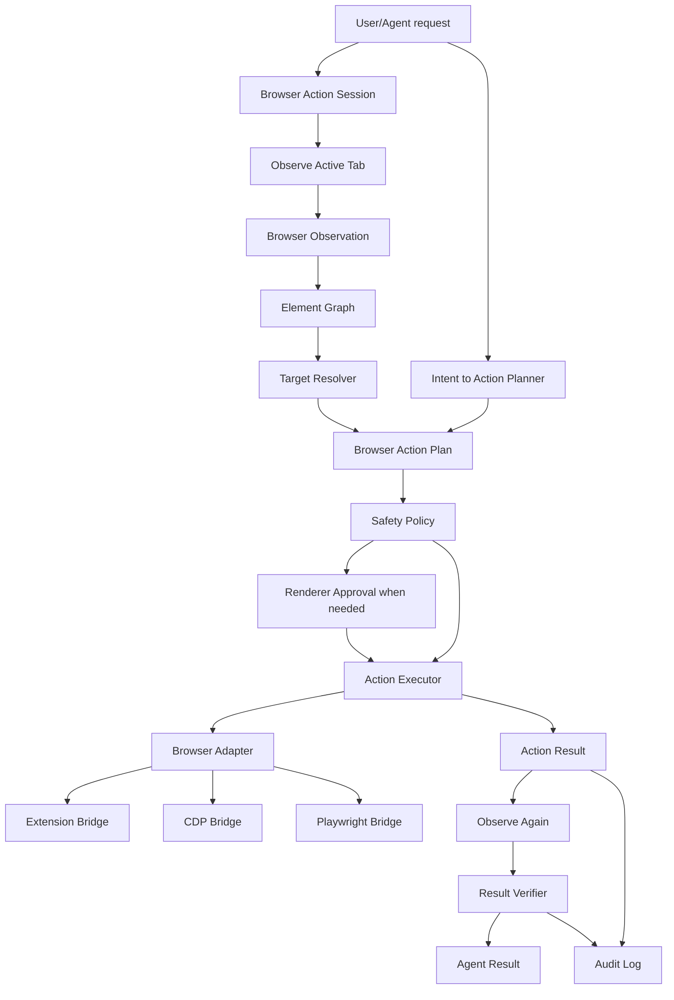

# Browser Action Interface Module Handoff

Status: production adapter/evaluate expansion implemented (Iteration `iter-10`, 2026-05-08)
Target repo: `C:\Users\Tony\Workspace\codex-widget-for-desktop`
Target integration: Tauri + React Codex Widget daemon, browser DOM extension, optional native host, Codex app-server runtime
Primary goal: build an independent daemon-side interface module that lets the Agent observe, plan, execute, and verify browser actions through typed, auditable browser control adapters.

## 0. Implementation Status

Implemented through Iteration `iter-10`:

- `src/daemon/browser-action/` owns shared types, session/timeline state, normalized `BrowserObservation`, `ElementGraph`, target resolver, intent boundary, safety policy, adapter registry/status diagnostics, timeout/error normalization, extension/direct adapter execution paths, result verifier, audit helpers, and production adapter surfaces.
- The extension adapter preserves the original snapshot button behavior while adding structured `elements[]`, stable element ids/selectors, focused element metadata, viewport metadata, and typed action execution for read, click, type, select, check, scroll, navigate, back, forward, reload, screenshot, and approved `full_control_dev` evaluate.
- The Playwright adapter is functional for controlled-browser sessions. It can observe deterministic/local/real pages, execute typed read/click/type/select/check/scroll/navigate/back/forward/reload/screenshot/evaluate where safe, and return before/after verification evidence.
- The CDP adapter is functional when `CODEX_WIDGET_BROWSER_ACTION_CDP_URL`, `BROWSER_ACTION_CDP_URL`, or `CDP_URL` points to a Chrome/Edge remote-debugging endpoint or page WebSocket. It can observe DOM metadata, execute typed actions, capture screenshots, and returns clear unavailable/error diagnostics when remote debugging is not configured.
- The Windows native desktop adapter is a bounded browser-window diagnostics boundary, not a placeholder. It can report Windows browser-window availability when `CODEX_WIDGET_BROWSER_ACTION_NATIVE_DESKTOP=1`; executable browser chrome actions are `BLOCKED` until a scoped UI Automation/native input helper is added.
- `full_control_dev` evaluate is implemented as an explicit non-default capability. Normal Browser Action mode rejects evaluate. Full-control mode requires visible approval with code preview, code hash, timeout, result limit, and credential/cookie/token/password/payment extraction safeguards. Audit stores metadata such as code hash without persisting code preview or secret values.
- The daemon exposes `browserAction.start/adapters/observe/execute/cancel` over WebSocket and `/browser-action/extension/poll` plus `/browser-action/extension/result` over local HTTP for the extension/native-host-compatible command loop.
- Renderer protocol handling records Browser Action started/adapter-status/observation/progress/result/error events in Activity, and risky Browser Actions reuse the existing `interaction.required` approval UI. Evaluate approvals show code preview and hash.
- Agent visibility is handled through widget context and fake app-server smoke coverage. A hidden custom app-server client-tool bridge remains `BLOCKED` on Codex app-server exposing a stable custom tool contract; current coverage uses daemon protocol/tool simulation instead of prompt-only claims.
- Real semantic dogfood evidence exists at `docs/reports/browser-action-dogfood-evidence-2026-05-08.md`, with supporting JSON and screenshot assets under `docs/reports/assets/browser-action-dogfood-2026-05-08/`.

Known `BLOCKED` or external-boundary items:

- Native desktop executable browser chrome control requires a scoped Windows UI Automation or bounded native input helper. The current adapter intentionally reports this unsupported state rather than pretending desktop computer-use is complete.
- Restricted browser pages such as browser settings, extension pages, Web Store pages, and browser PDF internals remain subject to browser/extension/CDP security boundaries. The module must report unsupported state or use a configured fallback adapter rather than bypassing browser security.
- A first-class Codex app-server custom Browser Action tool remains blocked on a stable app-server custom-tool/client-tool contract; daemon protocol and fake app-server/widget-context smokes cover the current visible capability and simulated action/result flow.

## 1. Session Summary

This handoff captures the design direction for a Browser Action Interface.

The current DOM provider is intentionally read-only:

- `providers/browser-dom-extension/service-worker.js` injects a fixed `collectDomSnapshot()` function into the active tab.
- The extension sends URL/title/selection/page text/interactive labels to the daemon through native messaging or local HTTP.
- The daemon stores the latest DOM snapshot and injects it into Agent context.

That is useful for "read this page" tasks, but it cannot perform browser work such as clicking buttons, filling forms, navigating flows, or validating that a requested action completed.

The long-term product direction is Windows computer-use parity as much as practical. That full objective requires multiple capabilities:

- browser DOM and action control
- screen/Vision Context
- Windows UI Automation
- mouse/keyboard control
- terminal and file tools
- safety/approval/audit infrastructure

This handoff scopes only the browser actuator layer. It should be built as an independent module that can later plug into a broader computer-use orchestrator.

## 2. Product Goal

Build a standalone Browser Action Interface that lets a user ask the Agent to perform browser tasks like:

- "이 페이지에서 로그인 버튼 눌러줘."
- "GitHub issue 제목을 이렇게 바꿔줘."
- "이 폼을 채우고 제출 직전까지 가줘."
- "문서에서 billing 설정 찾아서 현재 값 알려줘."
- "이 페이지에서 다운로드 링크 찾아서 열어줘."

The module should support an observe-plan-act-verify loop:

1. observe the active browser tab
2. normalize DOM, accessibility-like metadata, visible text, and target candidates
3. resolve the requested target/action
4. apply safety policy
5. execute through a browser adapter
6. observe again
7. verify result or request clarification

The user-facing goal is not "run arbitrary scripts in my browser." The user-facing goal is:

`Use Agent to operate the current browser page.`

## 3. Non-Goals

This module is not the full Windows computer-use implementation.

Out of scope for the Browser Action Interface:

- controlling arbitrary desktop apps outside the browser
- OS-level mouse/keyboard automation
- CAPTCHA bypass
- password manager extraction
- bank/payment automation without explicit confirmation
- background monitoring of pages
- hidden page surveillance
- arbitrary JavaScript as the default execution path
- bypassing browser, site, extension, or OS security restrictions

The module includes explicit full-control/dev capability gates, but the normal path remains typed, auditable, and deterministic.

## 4. High-Level Architecture



## 5. Module Boundaries

Implement as a daemon-side module plus thin protocol/extension integration.

Suggested ownership:

```text
src/daemon/browser-action/
  index.ts
  types.ts
  actionSession.ts
  actionTimeline.ts
  browserObservation.ts
  elementGraph.ts
  targetResolver.ts
  intentToAction.ts
  safetyPolicy.ts
  actionExecutor.ts
  resultVerifier.ts
  auditLog.ts
  adapters/
    extensionAdapter.ts
    cdpAdapter.ts
    playwrightAdapter.ts
    nativeDesktopAdapter.ts
```

Thin integration points:

```text
providers/browser-dom-extension/
  service-worker.js
  options.html
  options.js

providers/browser-native-host/
  native-host.mjs
  install-native-messaging-host.ps1

src/shared/protocol.ts
src/daemon/server.ts
src/renderer/*
```

Responsibilities:

- accept browser action sessions from renderer/Agent flows
- observe current tab state
- normalize browser observations into stable element/action models
- resolve target ambiguity
- apply action safety policy
- execute through extension/CDP/Playwright adapters
- verify before/after state
- record audit evidence
- expose progress/results to renderer and Agent turns

## 6. Core Concepts

### 6.1 Browser Action Session

A `BrowserActionSession` is one browser task loop.

```ts
export type BrowserActionSession = {
  id: string;
  sessionId?: string;
  startedAt: string;
  stoppedAt?: string;
  source: BrowserActionSource;
  mode: BrowserActionMode;
  status: "active" | "completed" | "cancelled" | "error";
  timeline: BrowserActionTimelineEvent[];
  approvals: BrowserActionApproval[];
};
```

```ts
export type BrowserActionSource = {
  kind: "active_tab" | "tab" | "controlled_browser" | "debug_target";
  browser?: "chrome" | "edge" | "chromium" | "unknown";
  tabId?: string;
  url?: string;
  title?: string;
  windowId?: string;
};
```

```ts
export type BrowserActionMode =
  | "read_only"
  | "ask_before_action"
  | "auto_safe_actions"
  | "full_control_dev";
```

Default should be `ask_before_action` or `auto_safe_actions`, not `full_control_dev`.

### 6.2 Browser Observation

`BrowserObservation` is the normalized state of a page.

```ts
export type BrowserObservation = {
  id: string;
  capturedAt: string;
  source: BrowserActionSource;
  url: string;
  title: string;
  readyState?: "loading" | "interactive" | "complete";
  viewport?: BrowserViewport;
  selection?: string;
  focusedElementId?: string;
  text?: string;
  elements: BrowserElement[];
  screenshot?: BrowserImageEvidence;
  console?: BrowserConsoleSummary;
  network?: BrowserNetworkSummary;
};
```

Observation should prioritize:

- URL
- title
- selected text
- body text
- interactive elements
- element labels
- role/name-like metadata
- visible/enabled/focused flags
- bounding boxes where available

Console and network summaries are useful, but they can wait for CDP/Playwright adapters.

### 6.3 Browser Element

The module should not force the Agent to reason directly over raw CSS selectors. Each element should have a stable session-local id.

```ts
export type BrowserElement = {
  id: string;
  role?: string;
  tagName: string;
  label?: string;
  text?: string;
  value?: string;
  placeholder?: string;
  ariaLabel?: string;
  title?: string;
  selector?: string;
  xpath?: string;
  bbox?: Rect;
  visible: boolean;
  enabled: boolean;
  editable: boolean;
  checked?: boolean;
  selected?: boolean;
  href?: string;
  inputType?: string;
  confidence: number;
  riskHints: BrowserElementRiskHint[];
};
```

```ts
export type BrowserElementRiskHint =
  | "password"
  | "payment"
  | "delete"
  | "submit"
  | "file_upload"
  | "download"
  | "external_navigation"
  | "auth"
  | "unknown_side_effect";
```

### 6.4 Element Graph

The `ElementGraph` groups observed elements and relationships.

```ts
export type ElementGraph = {
  observationId: string;
  elements: BrowserElement[];
  groups: BrowserElementGroup[];
  edges: BrowserElementEdge[];
};
```

Example relationships:

- label controls input
- button belongs to form
- link navigates external origin
- checkbox belongs to setting row
- submit button belongs to form with sensitive fields

The graph should help answer:

- which element did the user mean?
- is the action safe?
- what should be verified after execution?

## 7. Action Model

### 7.1 Typed Browser Actions

Production action schema:

```ts
export type BrowserAction =
  | { type: "read"; reason?: string }
  | { type: "click"; target: ElementTarget; button?: "left" | "middle" | "right" }
  | { type: "type"; target: ElementTarget; text: string; clearFirst?: boolean; submit?: boolean }
  | { type: "select"; target: ElementTarget; value: string }
  | { type: "check"; target: ElementTarget; checked: boolean }
  | { type: "scroll"; direction: "up" | "down" | "left" | "right"; amount?: "small" | "medium" | "large" | number }
  | { type: "navigate"; url: string }
  | { type: "back" }
  | { type: "forward" }
  | { type: "reload" }
  | { type: "hotkey"; keys: string[] }
  | { type: "screenshot"; fullPage?: boolean }
  | { type: "evaluate"; code: string; target?: ElementTarget; timeoutMs?: number; resultLimitBytes?: number };
```

```ts
export type ElementTarget =
  | { kind: "element_id"; id: string }
  | { kind: "selector"; selector: string }
  | { kind: "text"; text: string; role?: string }
  | { kind: "bbox"; bbox: Rect }
  | { kind: "focused" };
```

The preferred target form is `element_id`. Selector and bbox targets are fallbacks.

### 7.2 Full-Control Dev Action

Arbitrary JavaScript is a separate high-risk capability, not the default abstraction.

```ts
export type BrowserDevAction = {
  type: "evaluate";
  code: string;
  expectedEffect?: string;
  requiresApproval: true;
};
```

Implemented rules:

- never use `evaluate` as the normal Browser Action default
- require explicit `full_control_dev` mode
- show code and expected effect before execution
- log code hash/result metadata without persisting code preview or secret values
- block obvious credential/cookie/token extraction by default unless the user explicitly overrides

## 8. Action Plan

The Agent should not execute a single raw action blindly. It should produce or request a plan.

```ts
export type BrowserActionPlan = {
  id: string;
  sessionId: string;
  goal: string;
  steps: BrowserActionStep[];
  expectedOutcome?: string;
  confidence: number;
};
```

```ts
export type BrowserActionStep = {
  id: string;
  action: BrowserAction;
  targetSummary?: string;
  reason: string;
  expectedAfter?: BrowserExpectedState;
  safety: BrowserActionSafetyDecision;
};
```

Current implementation executes one action at a time through the session manager and keeps the data model ready for multi-step plans.

## 9. Safety Policy

The product owner intends this as a personal high-control widget, but safety policy is still necessary. The policy should exist so the user can choose a more permissive mode without losing auditability.

### 9.1 Safe Auto Candidates

These may run automatically in `auto_safe_actions` mode:

- read
- screenshot
- scroll
- focus
- non-submitting click on ordinary navigation or UI expansion
- typing into clearly non-sensitive text fields when the text came from the user prompt
- browser back/forward/reload when no unsaved form state is detected

### 9.2 Confirmation Required

These require renderer confirmation unless the user explicitly enables a matching saved permission:

- form submit
- send/post/publish/comment
- delete/remove/archive
- purchase/pay/checkout
- login/logout
- password/token/API key entry
- file upload
- download/open external file
- permission prompts
- cross-origin navigation with likely side effects
- repeated actions with unclear result

### 9.3 Block or Clarify

Block or clarify when:

- target confidence is low and the action has side effects
- multiple plausible destructive targets exist
- the page is a browser security page or unsupported internal page
- the extension cannot observe or execute in the target frame
- the action would require credentials the user has not provided
- the action tries to bypass CAPTCHA, 2FA, payment confirmation, or site security

### 9.4 Full Control Dev Mode

`full_control_dev` can allow:

- arbitrary JavaScript
- raw selectors
- CDP commands
- local browser profile inspection

But the module must keep:

- explicit mode switch
- visible action transcript
- per-action audit log
- easy stop/cancel
- optional saved permissions

## 10. Adapter Contract

Adapters execute browser operations against different control backends.

```ts
export type BrowserActionAdapter = {
  id: string;
  label: string;
  capabilities: BrowserActionCapability[];
  isAvailable(input: BrowserAdapterAvailabilityInput): Promise<boolean>;
  observe(input: BrowserObserveInput): Promise<BrowserObservation>;
  execute(input: BrowserExecuteInput): Promise<BrowserActionExecutionResult>;
};
```

```ts
export type BrowserActionCapability =
  | "observe_dom"
  | "observe_accessibility"
  | "screenshot"
  | "click"
  | "type"
  | "select"
  | "scroll"
  | "navigate"
  | "hotkey"
  | "console"
  | "network"
  | "evaluate"
  | "download"
  | "tab_control";
```

```ts
export type BrowserExecuteInput = {
  session: BrowserActionSession;
  observation: BrowserObservation;
  action: BrowserAction;
  target?: BrowserElement;
  timeoutMs?: number;
};
```

Adapters must not render final Agent prompts. They only return observations, execution results, and errors.

## 11. Built-In Adapters

### 11.1 Extension Adapter

Implemented active-tab adapter.

Responsibilities:

- extend the existing DOM extension beyond snapshot posting
- support a message/request channel between daemon/native host and extension
- observe the active tab
- execute typed actions in the active tab
- return refreshed observation after execution

Implementation options:

1. extension polls daemon for pending actions
2. extension opens a local WebSocket to daemon
3. native host keeps a request/response pipe between daemon and extension

Implemented path:

- keep HTTP snapshot path for backwards compatibility
- use daemon polling from the extension service worker for queued typed actions
- return before/after observation evidence through `/browser-action/extension/result`

### 11.2 Native Host Adapter

The existing native host is currently a forwarder from extension to daemon. It can become a bridge for reliable request/response action delivery.

Responsibilities:

- register under `com.mir3626.codex_widget_dom`
- validate local daemon URL
- forward `domSnapshot`
- forward `browserAction.observe`
- forward `browserAction.execute`
- report extension availability and active tab state

The native host should not decide final prompts or safety policy.

### 11.3 CDP Adapter

Implemented advanced adapter when remote debugging is configured.

Useful for:

- controlled Chrome/Edge debugging sessions
- console/network inspection
- screenshots
- reliable selector execution
- tab control
- downloads

Constraints:

- needs a browser launched with remote debugging or attached through allowed debugging path
- may not control the user's existing default profile unless explicitly launched/configured
- strong but more invasive than extension-only action
- reports clear unavailable diagnostics when no endpoint is configured

### 11.4 Playwright Adapter

Implemented test and controlled-browser adapter.

Useful for:

- deterministic smoke tests
- controlled browser profiles
- robust locator actions
- before/after assertions

Constraint:

- it controls a Playwright browser context, not necessarily the user's already-open active tab.

### 11.5 Native Desktop Adapter

Implemented bounded Windows browser-window diagnostics boundary.

Blocked future responsibilities:

- Windows UI Automation
- mouse/keyboard injection
- OCR/Vision fallback
- browser chrome controls outside page DOM

It shares the action/result/audit model and reports unsupported executable actions clearly. Production browser chrome control is blocked until a scoped UI Automation/native input helper is added.

## 12. Extension Protocol

The current extension only sends snapshots. Browser Action needs bidirectional commands.

Implemented daemon events:

```ts
type ClientMessage =
  | { type: "browserAction.start"; actionSessionId?: string; sessionId?: string; mode?: BrowserActionMode }
  | { type: "browserAction.adapters"; actionSessionId?: string }
  | { type: "browserAction.observe"; actionSessionId: string; adapterId?: string }
  | { type: "browserAction.execute"; actionSessionId: string; action: BrowserAction; requestId?: string; adapterId?: string }
  | { type: "browserAction.cancel"; actionSessionId: string };
```

```ts
type ServerEvent =
  | { type: "browserAction.started"; actionSessionId: string }
  | { type: "browserAction.adapters"; actionSessionId?: string; adapters: BrowserActionAdapterStatus[] }
  | { type: "browserAction.observation"; actionSessionId: string; observationSummary: unknown }
  | { type: "browserAction.progress"; actionSessionId: string; status: string; detail?: unknown }
  | { type: "browserAction.result"; actionSessionId: string; result: BrowserActionResultSummary }
  | { type: "browserAction.error"; actionSessionId: string; error: string };
```

Suggested extension/native messages:

```ts
type ExtensionToDaemonMessage =
  | { type: "browser.available"; extensionId: string; browser: string }
  | { type: "browser.observation"; requestId: string; observation: BrowserObservation }
  | { type: "browser.actionResult"; requestId: string; result: BrowserActionExecutionResult };
```

```ts
type DaemonToExtensionMessage =
  | { type: "browser.observe"; requestId: string; options?: BrowserObserveOptions }
  | { type: "browser.execute"; requestId: string; action: BrowserAction; target?: BrowserElement }
  | { type: "browser.cancel"; requestId?: string };
```

## 13. Element Target Resolution

The resolver should rank targets using:

- exact element id
- role/name match
- label text
- placeholder
- selected/focused state
- spatial hints from Vision Context
- page text near element
- URL/domain context
- prior action timeline
- Agent-provided target phrase

Output:

```ts
export type TargetResolution = {
  primary?: BrowserElement;
  alternatives: BrowserElement[];
  confidence: number;
  reason: string;
};
```

Rules:

- high-confidence safe action may proceed
- low-confidence read/scroll can proceed with uncertainty
- low-confidence side-effect action must clarify
- multiple destructive candidates must clarify

## 14. Result Verification

Every action should produce a verification strategy.

```ts
export type BrowserExpectedState =
  | { type: "url_contains"; value: string }
  | { type: "text_visible"; value: string }
  | { type: "element_state"; target: ElementTarget; state: Partial<BrowserElement> }
  | { type: "navigation_complete" }
  | { type: "network_idle" }
  | { type: "no_error_toast" }
  | { type: "custom"; description: string };
```

```ts
export type BrowserActionResult = {
  id: string;
  actionSessionId: string;
  action: BrowserAction;
  startedAt: string;
  completedAt?: string;
  status: "succeeded" | "failed" | "needs_approval" | "needs_clarification" | "cancelled";
  before?: BrowserObservation;
  after?: BrowserObservation;
  verification: BrowserVerificationResult;
  error?: string;
};
```

Verification should prefer deterministic checks before screenshot-only checks:

1. URL/title/DOM state
2. target element state
3. visible text
4. network/console if available
5. screenshot/Vision fallback

## 15. Agent Integration

Browser Action should be exposed to the Agent as a tool-like runtime capability, not as hidden magic.

Potential integration paths:

### 15.1 Renderer-Initiated Action

The user explicitly clicks a Browser Action UI control or asks in DOM mode. Renderer sends `browserAction.*` messages to daemon. Daemon handles observe/execute/approval and reports results.

### 15.2 Agent Tool Runtime

The daemon can expose browser actions as a runtime tool available to Codex app-server turns when the active session has browser control enabled.

The tool should present:

- current observation summary
- allowed actions
- safety mode
- whether confirmation is required
- compact result after each action

### 15.3 Vision Context Bridge

Vision Context can provide spatial hints:

- user circles a button in screen share
- Vision Context resolves bbox
- Browser Action maps bbox to DOM element
- action executor clicks typed target

This is the bridge toward Windows computer-use.

## 16. Audit Log

Every action should produce durable audit evidence.

```ts
export type BrowserActionAuditEntry = {
  id: string;
  actionSessionId: string;
  sessionId?: string;
  createdAt: string;
  level: "info" | "warn" | "error";
  category: "observe" | "resolve" | "approval" | "execute" | "verify" | "safety";
  summary: string;
  detail?: unknown;
};
```

Audit entries should feed existing Activity/ledger surfaces.

Do not store full page HTML by default. Prefer:

- URL/title
- action summary
- target summary
- verification outcome
- redacted text snippets
- optional screenshot path only when explicitly captured

## 17. Privacy and Retention

Default retention:

- keep latest observation summary in provider registry
- keep action audit metadata
- do not persist full DOM HTML
- do not persist sensitive field values
- redact password/token/payment values
- keep screenshots only when explicitly requested or needed for verification

Action execution should avoid reading:

- cookies
- localStorage/sessionStorage values
- password field contents
- token-like input values
- hidden CSRF/auth fields

Full-control dev mode can later add explicit opt-in access, but not as default.

## 18. UI Integration

Renderer should expose a small control surface rather than a large browser automation dashboard.

Suggested states:

- Browser connected
- Snapshot attached
- Action session active
- Waiting for approval
- Executing
- Verified
- Failed

Controls:

- Start browser action session
- Stop/cancel
- Safety mode selector
- Approve/deny action
- View action log

The action approval card should show:

- target page
- action type
- target summary
- expected effect
- risk reason
- `Allow once`
- optional `Always allow similar safe action`
- `Deny`

Do not show arbitrary JavaScript execution UI in MVP.

## 19. Current DOM Extension Upgrade Path

Existing extension collector:

```js
chrome.scripting.executeScript({
  target: { tabId },
  func: collectDomSnapshot
});
```

MVP upgrade:

1. enrich `collectDomSnapshot()` to return structured `elements[]`
2. add deterministic element ids
3. add safe selector generation
4. add action executor functions for typed actions
5. return before/after observation
6. preserve the current snapshot button behavior

Example executor shape inside extension:

```js
async function executeBrowserAction(action, target) {
  if (action.type === "click") {
    const element = resolveElement(target);
    element.click();
    return collectDomSnapshot();
  }
  if (action.type === "type") {
    const element = resolveElement(target);
    element.focus();
    if (action.clearFirst) element.value = "";
    element.value += action.text;
    element.dispatchEvent(new InputEvent("input", { bubbles: true, inputType: "insertText", data: action.text }));
    element.dispatchEvent(new Event("change", { bubbles: true }));
    return collectDomSnapshot();
  }
}
```

Important: this is typed action execution, not arbitrary Agent-provided JavaScript.

## 20. Hard Cases and Required Handling

### Case A: Ambiguous Button

User:

> 저장 눌러줘.

Page has multiple `Save` buttons.

Required behavior:

- return alternatives with labels/nearby context
- ask the user to choose if action has side effects
- allow proceeding automatically only if one target is clearly primary and risk is low

### Case B: Form Submit

User:

> 이 폼 제출해.

Required behavior:

- identify submit target and form fields
- summarize outgoing action
- require confirmation unless user has matching saved permission
- verify navigation or success message after submit

### Case C: Typing Sensitive Data

User:

> 비밀번호 입력해.

Required behavior:

- do not infer or retrieve password
- if user explicitly provides text, require confirmation before entering into password field
- never echo password in audit logs

### Case D: SPA Custom Control

Page uses div buttons, shadow DOM, or custom select.

Required behavior:

- prefer role/name and bbox
- fallback to trusted selector
- if action fails, reobserve and report exact failure
- future CDP/Playwright adapter can improve reliability

### Case E: Page Changed During Action

Required behavior:

- detect stale element
- reobserve once
- retry only if target can be resolved again with high confidence
- otherwise clarify

### Case F: Browser Unsupported Page

Examples:

- `chrome://extensions`
- Chrome Web Store
- PDF viewer with restricted injection
- extension pages

Required behavior:

- report unsupported action boundary
- offer manual steps or CDP/native fallback if configured

## 21. Arbitrary JavaScript Policy

Arbitrary JavaScript is powerful and similar in broad capability to userscript tools like Tampermonkey, but Agent-generated code changes the risk profile.

Normal-mode policy:

- no arbitrary JS action in normal Browser Action mode
- typed actions only
- extension-owned helper functions only

Implemented dev policy:

- explicit `full_control_dev` mode
- renderer confirmation with code preview
- code hash in audit log
- result size limit
- block credential/token/cookie extraction by default
- user can proceed only with a visible high-risk approval; credential-extraction safeguards block by default

The architecture includes `evaluate`, but normal Browser Action operation does not depend on it.

## 22. Integration with Existing Repo

Relevant existing files:

- `providers/browser-dom-extension/service-worker.js`
- `providers/browser-dom-extension/options.html`
- `providers/browser-dom-extension/options.js`
- `providers/browser-native-host/native-host.mjs`
- `providers/browser-native-host/install-native-messaging-host.ps1`
- `src/daemon/providers/providerRegistry.ts`
- `src/daemon/server.ts`
- `src/shared/protocol.ts`
- `src/daemon/codexAppServer.ts`
- `src/daemon/widgetContext.ts`
- `src/renderer/components/*`
- `scripts/smoke-browser-extension.mjs`
- `scripts/smoke-browser-native-host.mjs`
- `scripts/smoke-dom-provider.mjs`
- `scripts/smoke-codex-app-server.mjs`

Existing provider registry can keep the latest DOM snapshot, but Browser Action should own action sessions and action audit state.

## 23. Completed Implementation Sprints

Iteration `iter-9` delivered the deterministic daemon/extension baseline below. Iteration `iter-10` completed the production adapter/evaluate expansion:

- adapter registry, adapter status protocol, timeout/error normalization, and direct adapter execution path
- Playwright controlled-browser adapter with real observe/execute/screenshot smoke coverage
- CDP remote-debugging adapter with managed Chromium smoke coverage
- Windows native desktop boundary with availability diagnostics and explicit UI Automation `BLOCKED` record
- explicit `full_control_dev` evaluate gate with normal-mode rejection, approval preview/hash, result limits, timeout limits, and credential safeguards
- semantic dogfood evidence on a real public page in `docs/reports/browser-action-dogfood-evidence-2026-05-08.md`

### Sprint 1: Types and Observation Model

Deliver:

- `src/daemon/browser-action/types.ts`
- `BrowserActionSession`
- `BrowserObservation`
- `BrowserElement`
- `ElementGraph`
- deterministic fixture observations

Acceptance:

- fixture page observation normalizes URL/title/text/elements
- element ids are stable within an observation
- sensitive field values are redacted

### Sprint 2: Element Graph and Target Resolver

Deliver:

- `elementGraph.ts`
- `targetResolver.ts`
- target ranking by role/name/text/placeholder/focused/bbox
- alternatives with confidence

Acceptance:

- exact role/name resolves target
- ambiguous labels produce alternatives
- destructive low-confidence target requires clarification

### Sprint 3: Safety Policy

Deliver:

- `safetyPolicy.ts`
- safe/confirm/block classification
- renderer approval decision shape
- saved permission compatibility with existing execution permission UI where practical

Acceptance:

- read/scroll safe
- submit/delete/pay/send require confirmation
- password/payment fields are redacted and high risk

### Sprint 4: Extension Observation Upgrade

Deliver:

- structured `elements[]` from DOM extension snapshot
- stable element ids/selectors
- updated daemon DOM snapshot ingestion
- smoke page fixture

Acceptance:

- extension smoke verifies structured elements
- daemon provider history still records redacted DOM snapshot
- old snapshot-only path remains compatible

### Sprint 5: Typed Action Executor MVP

Deliver:

- extension executor for `click`, `type`, `scroll`, `navigate`, `read`
- daemon `actionExecutor.ts`
- result shape and action timeline

Acceptance:

- fake page button click changes page state
- input typing fires input/change events
- scroll changes viewport or reports no-op
- navigate updates URL

### Sprint 6: Protocol and Renderer Approval

Deliver:

- `browserAction.*` shared protocol messages
- daemon session manager integration
- renderer approval/progress UI
- cancel/stop path

Acceptance:

- user sees action approval for risky actions
- approved action executes
- denied action does not execute
- cancel stops pending session

### Sprint 7: Agent Tool Integration

Deliver:

- Agent-visible browser action capability
- app-server/fake app-server smoke path
- concise action result returned to Agent
- widget context updated with Browser Action mode/capabilities

Acceptance:

- fake app-server can request a browser action through daemon tool path or simulated action flow
- action result is visible in chat/activity
- no hidden browser action occurs without configured permission

### Sprint 8: Verification and Future Adapter Scaffolds

Deliver:

- CDP/Playwright/native adapter interfaces as placeholders
- smoke coverage for typed action loop
- audit log integration
- documentation update

Acceptance:

- smokes pass for observe, resolve, approve, execute, verify
- unsupported adapter paths fail gracefully
- audit entries are recorded

## 24. Testing Strategy

### Unit Tests

- target resolver
- safety policy
- element graph builder
- action plan validation
- verification result evaluator
- redaction helpers

### Smoke Tests

Suggested scripts:

```text
scripts/smoke-browser-action-observe.mjs
scripts/smoke-browser-action-execute.mjs
scripts/smoke-browser-action-approval.mjs
scripts/smoke-browser-action-app-server.mjs
scripts/smoke-browser-action-playwright.mjs
scripts/smoke-browser-action-cdp.mjs
scripts/smoke-browser-action-evaluate.mjs
scripts/smoke-browser-action-native.mjs
scripts/collect-browser-action-dogfood-evidence.mjs
```

Scenarios:

1. read active tab
2. click button and verify text changes
3. type into input and verify value
4. ambiguous button alternatives
5. submit requires approval
6. password value redaction
7. unsupported page reports boundary
8. stale element reobserve

### Browser Extension Tests

- package still contains Manifest V3 root files
- service worker syntax check
- Options page URL validation
- native messaging fallback still works
- direct HTTP snapshot path still works

### Safety Tests

- delete/post/pay/send keywords require confirmation
- low-confidence target with side effect clarifies
- safe scroll/read can proceed
- arbitrary JS is unavailable outside full-control dev mode

## 25. Example Action Flow

User:

> 이 페이지에서 검색창에 "codex app-server" 입력하고 검색해줘.

Observation summary:

```json
{
  "url": "https://example.test/docs",
  "title": "Docs",
  "elements": [
    { "id": "el-search", "role": "searchbox", "label": "Search", "editable": true, "visible": true },
    { "id": "el-submit", "role": "button", "label": "Search", "visible": true }
  ]
}
```

Plan:

```json
{
  "steps": [
    {
      "action": { "type": "type", "target": { "kind": "element_id", "id": "el-search" }, "text": "codex app-server", "clearFirst": true },
      "safety": { "decision": "allow", "reason": "Typing user-provided text into searchbox is low risk." }
    },
    {
      "action": { "type": "click", "target": { "kind": "element_id", "id": "el-submit" } },
      "safety": { "decision": "allow", "reason": "Search button has low side-effect risk." }
    }
  ]
}
```

Result:

```json
{
  "status": "succeeded",
  "verification": {
    "status": "passed",
    "reason": "URL/query and page title changed after search."
  }
}
```

## 26. Open Questions

1. Should the MVP action channel use extension polling, WebSocket, or native host request/response?
2. Should Browser Action be available only in DOM mode, or also Agent mode when a DOM snapshot exists?
3. Should saved permissions share the existing execution permission table or use a browser-specific policy table?
4. How much of `elements[]` should persist in SQLite versus remain in memory?
5. Should Playwright be a first-class controlled-browser mode or test-only at first?
6. How should the UI expose full-control dev mode without normalizing unsafe use?
7. Should Vision Context bbox targeting be in MVP or Sprint 2 after typed action basics?
8. What is the first acceptable live dogfood task for semantic browser action acceptance?

## 27. Implementation Order Used

The implementation started with typed action interfaces before arbitrary JavaScript or CDP, then expanded into controlled adapters and full-control gating.

Order:

1. `BrowserObservation` and `BrowserElement`
2. target resolver
3. safety policy
4. extension structured observation
5. typed action executor
6. renderer approval
7. Agent tool/action loop
8. CDP/Playwright/dev `evaluate` expansion

Reason:

The product value is reliable browser operation by the Agent. Typed actions provide enough power for common workflows while preserving safety, testability, and later adapter portability.

## 28. Implementation Principle

Browser Action should treat the browser as an observed, auditable actuator.

The durable product is:

```text
User goal
Browser observation
Target resolution
Safety decision
Typed action
Execution result
Verification evidence
Audit log
```

The module should not make arbitrary JavaScript the core abstraction. It should make typed, verified browser actions the core abstraction, with arbitrary JavaScript reserved as an explicit future dev capability.
