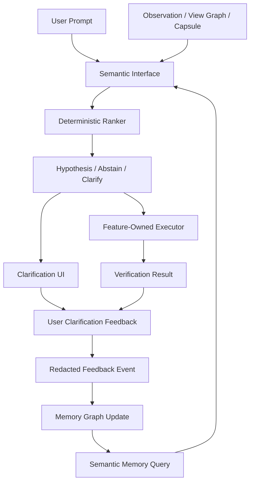

# Semantic Memory Handoff

Status: planning handoff (2026-05-09); not implemented; updated after Semantic Interface post-implementation Codex subagent design review
Target repo: `C:\Users\Tony\Workspace\codex-widget-for-desktop`
Primary dependency: `docs/plans/semantic-interface-handoff.md`
Related handoffs:
- `docs/plans/browser-action-interface-handoff.md`
- `docs/plans/browser-action-end-to-end-control-handoff.md`
- `docs/plans/browser-extension-bridge-handoff.md`

Primary goal: build a local, deterministic, privacy-preserving Semantic Memory layer that lets Semantic Interface improve from unresolved cases, user clarifications, user corrections, repeated instructions, and verified outcomes without becoming remote model training or a safety bypass.

## 0. Why This Handoff Exists

Browser Action, Browser Bridge, View Graph, and Semantic Interface made the widget better at understanding what the user means against observed state. Dogfood also exposed the next product need:

```text
The system should get better as this user uses it.
```

Examples:

- The user repeatedly says `개념글`; on DCInside board list pages this usually means the main list filter button, not a sidebar link or article label.
- The user says `새 채팅 눌러줘`; in this widget this usually means the visible New Chat control, not a broad sidebar container.
- The user says `서버 다시 띄워줘`; in this repo that may map to `npm run dev:services` or the existing dev-hot daemon restart path.
- The user says `핸드오프 업데이트해줘`; in this project that often means updating files under `docs/plans/` plus durable context files.

Today, each failure or clarification is mostly ephemeral. Semantic Memory should turn those events into durable, local, redacted evidence that can improve future ranking and clarification without weakening safety policy.

## 1. Product Goal

Create a local Semantic Memory subsystem under `semantic-interface`:

```text
semantic attempt
  -> success, failure, clarification, correction, verification
  -> redacted feedback event
  -> memory graph update
  -> future ranker uses memory as a small deterministic feature
  -> safety remains feature-owned and unchanged
```

The target user experience:

```text
The more I use the widget, the less I need to repeat myself.
```

The engineering target:

```text
Semantic Memory improves interpretation, not permissions.
```

## 2. Non-Goals

Semantic Memory must not:

- train a remote model
- upload user prompts, page text, screenshots, secrets, or raw traces
- persist password/token/payment/cookie/credential values
- persist full page text or full sensitive page state
- auto-allow destructive, submit, payment, auth, password, upload, download, or cross-origin side-effect actions
- bypass Browser Action safety policy, execution permissions, or approval UI
- convert arbitrary JavaScript/evaluate into a normal action path
- make LLM guesses part of deterministic memory without typed validation

Semantic Memory can improve:

- phrase aliases
- target concept priors
- preferred role/region for a phrase
- common action intent for a phrase
- origin/view-pattern-specific disambiguation
- workflow hints
- clarification suggestions

Semantic Memory cannot grant permission.

## 3. Design Principles

- Local-first: store only in the daemon-owned local database.
- Redacted by default: durable records store hashes, labels, safe summaries, and structured relations, not raw sensitive content.
- Deterministic: same memory state, same semantic input, same versioned ranker produces the same result.
- Feature-owned execution: Browser Action, Vision Context, Terminal, Workspace, and future UIA keep their own executors and safety policy.
- User-correctable: the user can inspect, delete, reset, or disable learned memory.
- Scoped: memory can be global, project-specific, surface-specific, origin-specific, or view-pattern-specific.
- Decayed: old low-evidence preferences fade unless reinforced.
- Auditable: every memory edge should cite redacted evidence events and schema versions.

## 4. High-Level Architecture



Memory is a ranker input, not a ranker replacement.

Memory must not enter the ranker as one opaque scalar. It should produce typed memory features that align with the Semantic Interface evidence packet. The final scalar score is only an ordering aid after hard gates, operating-profile gates, and pairwise margin checks.

Example typed feature flow:

```text
memory graph edges
  -> phrase alias feature
  -> preferred role feature
  -> preferred region feature
  -> usual action feature
  -> avoid target penalty
  -> scope strength
  -> evidence/recency confidence
  -> Semantic Interface candidate evidence packet
```

The memory contribution should be small at first. It can grow only with repeated evidence, margin checks, and safe scopes. It still cannot overcome stale/source mismatch, missing affordance, unsupported adapter capability, or safety policy.

2026-05-09 refinement:

Semantic Memory is a second-layer interpretation aid, not the first fix for Browser Action target-resolution failures. The immediate Browser Action failure class should be addressed first by View Graph, typed evidence packets, actionability gates, target fingerprint revalidation, pairwise margins, and structured clarification. Memory should then reduce repeated ambiguity within safe scopes.

Memory must enter ranking as an immutable `MemoryReadSet`, not as a live database query and not as `memoryPriorScore`. The ranker receives a frozen, redacted, versioned slice of relevant memory, and the trace records its hashes so the decision can be replayed.

## 5. Core Concepts

### 5.1 Unresolved Semantic Case

An unresolved case captures something the system could not understand well enough to act.

```ts
export type UnresolvedSemanticCase = {
  id: string;
  createdAt: string;
  semanticInterfaceVersion: string;
  surface: "browser" | "vision" | "terminal" | "workspace" | "screen" | "uia";
  failureKind:
    | "unknown_intent"
    | "unknown_reference"
    | "ambiguous_target"
    | "stale_view"
    | "missing_affordance"
    | "unsupported_surface"
    | "safety_blocked"
    | "verification_failed";
  utteranceHash: string;
  redactedUtterance?: string;
  scope: SemanticMemoryScope;
  candidates: RedactedSemanticCandidate[];
  traceId?: string;
  resolvedBy?: "clarification" | "retry" | "user_correction" | "manual";
  resolutionEventId?: string;
};
```

Failure cases are first-class learning inputs.

### 5.2 Clarification Event

Clarification turns ambiguity into explicit user-labeled data.

```ts
export type SemanticClarificationEvent = {
  id: string;
  caseId: string;
  createdAt: string;
  question: string;
  choices: SemanticClarificationChoice[];
  userAnswerKind: "choice" | "free_text" | "cancel";
  selectedChoiceId?: string;
  normalizedAnswer?: string;
  resultingIntentFrame?: unknown;
};
```

Example:

```text
"개념글" 후보가 여러 개 있어요.
1. 게시판 상단의 개념글 필터 버튼
2. 사이드바의 개념글 링크
3. 글 목록의 개념글 표시 글
```

If the user chooses the first option, future matching can prefer:

```text
phrase "개념글"
scope gall.dcinside.com board-list view
role button
region main/list-filter
affordance activate/filter
```

### 5.3 Semantic Memory Graph

Memory is a graph of phrases, concepts, scopes, actions, regions, roles, and user preferences.

```ts
export type SemanticMemoryNode = {
  id: string;
  kind:
    | "phrase"
    | "target_concept"
    | "intent_concept"
    | "role"
    | "region"
    | "affordance"
    | "workflow"
    | "surface"
    | "origin"
    | "view_pattern"
    | "project";
  key: string;
  label?: string;
  scope: SemanticMemoryScope;
  createdAt: string;
  updatedAt: string;
};
```

```ts
export type SemanticMemoryEdge = {
  id: string;
  fromNodeId: string;
  toNodeId: string;
  relation:
    | "alias_of"
    | "prefers_role"
    | "prefers_region"
    | "usually_action"
    | "disambiguated_to"
    | "avoid_target"
    | "site_specific_hint"
    | "project_hint"
    | "workflow_step";
  weight: number;
  evidenceCount: number;
  positiveCount: number;
  negativeCount: number;
  lastUsedAt?: string;
  createdAt: string;
  updatedAt: string;
  source: "clarification" | "verified_success" | "user_correction" | "manual_rule" | "import";
  safetyClass: "interpretation_only" | "requires_confirmation" | "never_auto_allow";
};
```

### 5.4 Scope

Memory must not overgeneralize one website or project into every context.

```ts
export type SemanticMemoryScope = {
  level: "global" | "project" | "surface" | "origin" | "view_pattern" | "session";
  projectId?: string;
  surface?: "browser" | "vision" | "terminal" | "workspace" | "screen" | "uia";
  origin?: string;
  viewPattern?: string;
  expiresAt?: string;
};
```

Examples:

- `global`: "새 채팅" is often "new chat".
- `project`: "핸드오프" in this repo points to `docs/plans/*`.
- `origin`: "개념글" on `gall.dcinside.com` board lists prefers the main filter button.
- `view_pattern`: "검색창" in a site header means the top search input.

### 5.5 Feedback Event

Feedback events update memory edges with controlled weights.

```ts
export type SemanticFeedbackEvent = {
  id: string;
  createdAt: string;
  source:
    | "clarification_selected"
    | "verified_action_success"
    | "verified_action_failure"
    | "user_correction"
    | "user_rejected_choice"
    | "manual_memory_edit";
  surface: SemanticMemoryScope["surface"];
  scope: SemanticMemoryScope;
  utteranceHash?: string;
  redactedUtterance?: string;
  selectedCandidate?: RedactedSemanticCandidate;
  rejectedCandidates?: RedactedSemanticCandidate[];
  verification?: {
    status: "passed" | "failed" | "unknown";
    reason: string;
  };
  memoryDelta: SemanticMemoryDelta[];
};
```

Suggested starting weights:

```text
clarification selected target: +0.25
verified successful action:    +0.10
same phrase repeated success:  +0.05
user correction:               -0.30 for rejected edge, +0.25 for corrected edge
failed verification:           -0.15
monthly decay:                 -10% for edges with no recent evidence
```

## 6. Privacy And Redaction

Durable memory may store:

- normalized phrase hashes
- short redacted phrase snippets
- target labels after secret redaction
- role/region/affordance
- origin or view pattern
- confidence/weight metadata
- redacted candidate summaries
- trace ids and schema versions

Durable memory must not store:

- password/token/payment/cookie/credential values
- full page text
- full DOM snapshots
- screenshot pixels
- unredacted user secrets
- localStorage/sessionStorage/cookie contents
- form values from password/payment/auth fields

Memory records should run through the same redaction policy family as Semantic Interface traces. Browser Action and future UIA must mark sensitive fields before memory ingestion.

## 7. Runtime Flow

### 7.1 Normal Successful Flow

```text
Prompt -> Semantic Interface -> memory query -> ranker -> high-confidence hypothesis
-> feature safety policy -> execute -> verify passed
-> feedback event -> small positive memory update
```

### 7.2 Ambiguous Flow

```text
Prompt -> ranker finds low margin
-> clarification with candidates
-> user selects one
-> execute if safe or approval passes
-> feedback event creates/updates disambiguation edge
```

### 7.3 Correction Flow

```text
Action result is wrong
User: "아니 그거 말고 상단 버튼"
-> correction parser links previous case
-> negative edge for wrong target
-> positive edge for corrected target
-> optional re-run with corrected target
```

### 7.4 Unknown Resolver Flow

```text
Semantic Interface returns unknown_intent or unknown_reference
-> unresolved case is logged
-> user can answer a clarification or proceed manually
-> repeated unresolved cases become resolver-gap report items
```

## 8. Ranker Integration

Semantic Memory contributes typed, immutable evidence to the Semantic Interface ranker. The ranker must not query SQLite or any mutable memory store directly during decision making.

Required read-set contract:

```ts
export type BasisPoints = number; // integer 0..10000

export interface MemoryReadSet {
  id: string;
  schemaVersion: string;
  storeVersion: string;
  decayEpoch: string;
  scope: SemanticMemoryScope;
  queryHash: string;
  resultHash: string;
  edges: RedactedMemoryEdge[];
  exclusions: MemoryReadExclusion[];
}

export interface MemoryReadExclusion {
  reason:
    | "scope_mismatch"
    | "stale_view"
    | "insufficient_evidence"
    | "conflict"
    | "safety_boundary"
    | "redacted";
  edgeId?: string;
  note?: string;
}
```

The Semantic Interface ranker receives only the `MemoryReadSet` projection and mapped memory evidence axes. This keeps replay deterministic:

```text
same semantic input + same memory read set hash + same ranker version
  -> same memory-assisted ranking decision
```

Semantic Memory contributes typed feature axes:

```ts
export type SemanticMemoryFeatures = {
  readSetId: string;
  phraseAliasBp: BasisPoints;
  conceptAliasBp: BasisPoints;
  preferredRoleBp: BasisPoints;
  preferredRegionBp: BasisPoints;
  preferredAffordanceBp: BasisPoints;
  usualActionBp: BasisPoints;
  workflowStepBp: BasisPoints;
  avoidTargetPenaltyBp: BasisPoints;
  scopeStrengthBp: BasisPoints;
  evidenceCountBp: BasisPoints;
  recencyBp: BasisPoints;
  contradictionPenaltyBp: BasisPoints;
  reasonCodes: string[];
};
```

These map into the Semantic Interface `CandidateEvidencePacket.memory` axes:

```text
memory.phraseAlias      <- phraseAliasBp / conceptAliasBp
memory.preferredRole    <- preferredRoleBp
memory.preferredRegion  <- preferredRegionBp
memory.usualAction      <- usualActionBp / preferredAffordanceBp
memory.avoidTarget      <- avoidTargetPenaltyBp / contradictionPenaltyBp
memory.scopeStrength    <- scopeStrengthBp / evidenceCountBp / recencyBp
```

Do not compress them into `memoryPriorScore` before gates run. A phrase alias prior should not compensate for a wrong region in the same way that a preferred-region prior can. A usual-action prior should not compensate for a missing affordance. Scope strength and evidence count modulate memory features, but they are not substitutes for observed evidence.

Rules:

- Memory cannot select a target by itself.
- Memory cannot overcome a stale/source mismatch.
- Memory cannot override missing affordance.
- Memory cannot bypass `abstain` when evidence is insufficient.
- Memory cannot change destructive/credential safety into allow.
- Memory cannot run before fresh observed candidates pass hard gates.
- Memory cannot be read from mutable storage during ranking.
- Memory can break ties only inside a safe confidence/margin envelope.

Example:

```text
If lexical and affordance evidence produce candidates A and B with similar scores,
memory can prefer A only when:
- scope matches,
- edge has enough positive evidence,
- no source/stale warning exists,
- action family is allowed for memory-assisted ranking,
- safety policy still passes.
```

## 9. Safety Policy Boundary

Safety policy remains feature-owned.

Allowed memory effects:

- choose the intended target among safe candidates
- ask a better clarification question
- suggest likely intent
- choose a non-destructive default for repeated benign workflows

Forbidden memory effects:

- "always submit this form"
- "always click delete"
- "always approve payment"
- "read token/password fields"
- "execute arbitrary JS"
- "bypass confirmation because the user did it before"

For risky actions, memory may prefill the explanation:

```text
You usually mean the repository settings delete button here, but this is destructive and still requires approval.
```

It must not remove the approval.

Clarification is also not approval. A remembered clarification such as "on this page, `개념글` usually means the main filter button" can help choose or present the target, but a risky action still requires the feature-owned safety approval flow.

## 10. Storage Model

Use daemon-owned SQLite. Suggested tables:

```sql
CREATE TABLE semantic_memory_nodes (
  id TEXT PRIMARY KEY,
  kind TEXT NOT NULL,
  key TEXT NOT NULL,
  label TEXT,
  scope_json TEXT NOT NULL,
  created_at TEXT NOT NULL,
  updated_at TEXT NOT NULL
);

CREATE TABLE semantic_memory_edges (
  id TEXT PRIMARY KEY,
  from_node_id TEXT NOT NULL,
  to_node_id TEXT NOT NULL,
  relation TEXT NOT NULL,
  weight REAL NOT NULL,
  evidence_count INTEGER NOT NULL DEFAULT 0,
  positive_count INTEGER NOT NULL DEFAULT 0,
  negative_count INTEGER NOT NULL DEFAULT 0,
  source TEXT NOT NULL,
  safety_class TEXT NOT NULL,
  last_used_at TEXT,
  created_at TEXT NOT NULL,
  updated_at TEXT NOT NULL
);

CREATE TABLE semantic_unresolved_cases (
  id TEXT PRIMARY KEY,
  created_at TEXT NOT NULL,
  surface TEXT NOT NULL,
  failure_kind TEXT NOT NULL,
  utterance_hash TEXT,
  redacted_utterance TEXT,
  scope_json TEXT NOT NULL,
  candidates_json TEXT NOT NULL DEFAULT '[]',
  trace_id TEXT,
  resolved_by TEXT,
  resolution_event_id TEXT
);

CREATE TABLE semantic_feedback_events (
  id TEXT PRIMARY KEY,
  created_at TEXT NOT NULL,
  source TEXT NOT NULL,
  surface TEXT,
  scope_json TEXT NOT NULL,
  utterance_hash TEXT,
  redacted_utterance TEXT,
  payload_json TEXT NOT NULL DEFAULT '{}',
  memory_delta_json TEXT NOT NULL DEFAULT '[]'
);
```

Indexes:

- `(kind, key)` on nodes
- `(from_node_id, relation)` on edges
- `(surface, failure_kind, created_at)` on unresolved cases
- `(source, created_at)` on feedback events

## 11. Module Layout

Suggested ownership:

```text
src/daemon/semantic-interface/
  memory/
    index.ts
    types.ts
    semanticMemoryStore.ts
    unresolvedCaseLog.ts
    clarificationModel.ts
    feedbackEvents.ts
    graphWeights.ts
    decay.ts
    memoryFeatures.ts
    privacy.ts
    reports.ts
```

Integration points:

```text
src/daemon/storage/
src/daemon/browser-action/
src/daemon/vision-context/
src/shared/protocol.ts
src/renderer/
scripts/smoke-semantic-memory.mjs
scripts/collect-semantic-memory-dogfood-evidence.mjs
```

## 12. UI And User Control

Minimum UI requirements:

- Clarification prompt with 2-5 ranked choices.
- "None of these" path.
- Short explanation of why clarification is needed.
- Memory settings:
  - enabled/disabled
  - clear all semantic memory
  - clear memory for current site/project
  - export redacted memory report
- Activity entries for memory-assisted decisions.

Do not expose raw traces or sensitive page data by default. Advanced diagnostics may show redacted trace ids and memory edge summaries.

## 13. Reporting

Semantic Memory should produce local reports:

- resolver gap ledger
- frequent unresolved phrases
- top clarification choices
- memory-assisted decisions
- memory edge decay/pruning summary
- false-positive/correction summary

Example report path:

```text
docs/reports/semantic-memory-dogfood-evidence-<date>.md
```

The report must be redacted and safe to commit only if it contains no private page text or secrets.

## 14. Recommended Implementation Sprints

### Sprint 1: Types, Storage, and Redaction Boundary

Deliver:

- memory type surface
- SQLite tables/migrations
- redaction helpers
- unresolved case schema
- basic store read/write tests

Acceptance:

- unresolved semantic cases can be recorded without raw sensitive data
- memory nodes/edges persist locally
- redaction smoke proves password/token/payment/cookie-like values are not stored

### Sprint 2: Clarification Protocol and UI

Deliver:

- shared protocol events for semantic clarification
- daemon clarification manager
- renderer clarification UI
- user answer handling
- unresolved case resolution linkage

Acceptance:

- ambiguous Browser Action target produces choices
- user selection updates a structured clarification event
- cancellation does not execute the action

### Sprint 3: Feedback Events and Graph Weight Updates

Deliver:

- feedback event collector for clarification, success, failure, and correction
- deterministic graph weight update rules
- decay/pruning job
- redacted Activity summaries

Acceptance:

- verified success increments safe interpretation edges
- user correction penalizes wrong edge and rewards corrected edge
- decay reduces stale low-evidence edges

### Sprint 4: Ranker Memory Prior Integration

Deliver:

- memory query API
- immutable `MemoryReadSet` with schema/store version, decay epoch, scope, query hash, result hash, exclusions, and redacted edge ids
- `SemanticMemoryFeatures`
- typed low-weight memory feature axes in Semantic Interface ranker
- scope matching and evidence threshold gates
- replay traces that show memory axes separately from the final scalar score

Acceptance:

- repeated clarified phrase reduces future clarification on the same scope
- memory cannot override stale/source mismatch
- memory cannot bypass safety confirmation
- memory cannot read mutable SQLite state during ranker execution
- memory features remain separate until hard gates and operating-profile gates pass
- deterministic replay includes memory version/hash and per-axis memory contributions

### Sprint 5: Cross-Surface Adapters

Deliver:

- Browser Action memory integration
- Vision Context read/locate memory feedback where safe
- Terminal/Workspace placeholder contracts
- project-scoped phrase handling

Acceptance:

- Browser Action duplicate-label case improves after clarification
- Vision read/locate phrases can store safe aliases
- Terminal/Workspace contracts do not force browser-specific assumptions into core

### Sprint 6: Dogfood, Reports, and Controls

Deliver:

- `npm run smoke:semantic-memory`
- dogfood evidence script/report
- settings/reset/export controls
- resolver gap report
- durable context/report updates

Acceptance:

- repeated prompts show measurable clarification reduction
- correction flow changes future ranking
- privacy reset deletes memory
- full Browser Action/Semantic Interface smokes remain passing

## 15. Verification Gate

Required verification when implemented:

```text
npm run lint
npm run build:web
npm run smoke
npm run smoke:semantic-interface
npm run smoke:semantic-memory
npm run smoke:browser-action
npm run smoke:browser-action:prompt-classification
npm run smoke:browser-bridge
npm run smoke:extension
npm run smoke:vision-context
npm run smoke:app-server
npm run dogfood:semantic-memory
git diff --check
UTF-8/mojibake checks for touched text files
npm run vibe:checkpoint
```

## 16. Completion Criteria

Semantic Memory is complete only when:

- unresolved semantic cases are durably recorded with redaction
- ambiguity can trigger structured clarification instead of generic failure
- clarification answers update local memory graph edges
- verified success/failure/correction feedback updates weights deterministically
- memory features affect ranking only within safe scoped thresholds
- memory is represented as typed feature axes, not an opaque scalar prior
- ranker integration uses immutable `MemoryReadSet` inputs with replay hashes and version/decay metadata
- memory cannot bypass safety, source freshness, unsupported capability, or approval rules
- clarification memory remains separate from safety approval
- user can inspect/reset/disable memory
- dogfood proves repeated phrasing reduces clarification without increasing unsafe actions
- reports and durable context reflect the state

## 17. Stop Conditions

Stop if:

- implementation requires storing raw secrets, full sensitive page text, or private screenshots
- memory would need to bypass Browser Action safety policy
- clarification UI requires broader renderer redesign outside the sprint
- statistical calibration requires a larger held-out trace corpus than currently available

If blocked, record:

- item
- reason
- attempted path
- required scope expansion
- verification evidence

Do not silently downgrade Semantic Memory into prompt-only heuristics.
